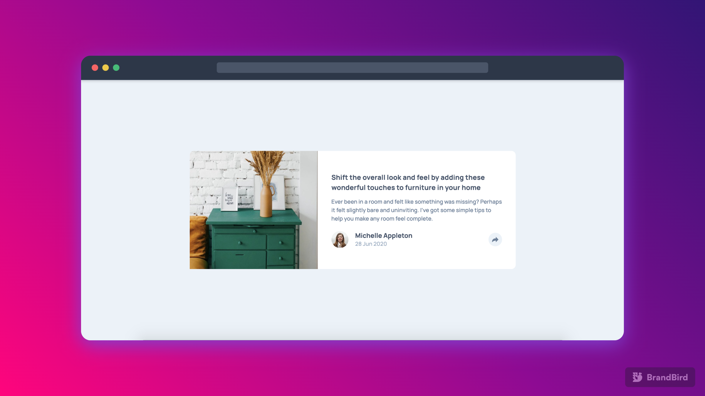

# Frontend Mentor - Article preview component solution

This is a solution to the [Article preview component challenge on Frontend Mentor](https://www.frontendmentor.io/challenges/article-preview-component-dYBN_pYFT). Frontend Mentor challenges help you improve your coding skills by building realistic projects.

## Table of contents

- [Overview](#overview)
  - [The challenge](#the-challenge)
  - [Screenshot](#screenshot)
  - [Links](#links)
- [My process](#my-process)
  - [Built with](#built-with)
  - [What I learned](#what-i-learned)
- [Author](#author)
- [Acknowledgments](#acknowledgments)

## Overview

### The challenge

Users should be able to:

- View the optimal layout for the component depending on their device's screen size
- See the social media share links when they click the share icon

### Screenshot

The Desktop Designs: Default | Active 
 

 

The Mobile Design: Default | Active 
 

### Links

- Solution URL: [GitHub Repo](https://github.com/akshaywebster/article-preview-component)
- Live Site URL: [Live Site](https://webster-article-preview.netlify.app/)

## My process

### Built with

- Semantic HTML5 markup
- CSS custom properties
- Flexbox
- Mobile-first workflow
- Vanilla JavaScript

### What I learned

My major learning from this project is to plan ahead for various scenarios. I started with mobile first approach in mind, so I structured my HTML elements accordingly, but later on when I came to write media queries for the desktop version, I realized that I should have used Grid, as it would have been much easier to transform the layout. Also, since I structured my HTML according to mobile-first approach, I had to do some restructuring as well to make the Flexbox layout work.

## Author

- Website - [Akshay Webster](https://www.akshaywebster.com)
- Frontend Mentor - [@akshaywebster](https://www.frontendmentor.io/profile/akshaywebster)
- Twitter - [@akshaywebster](https://www.twitter.com/akshaywebster)

## Acknowledgments

This was my first time working with design files in Figma, so this video by "Learn with Jason" came in handy: [Introduction to Figma for Developers (with Ryan Warner)](https://www.youtube.com/watch?v=cvJNN4vWHjk)
